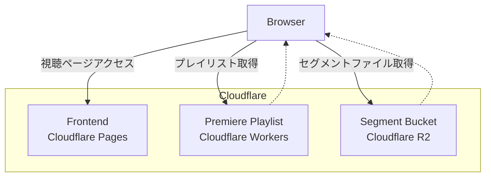

# poc-premier-vod

Cloudflare Workersを使用した、プレミア(スケジュール)配信の実証コードです。

## Architecture

```mermaid
graph TD
    b[Browser] --> |視聴ページアクセス|fe
    b --> |プレイリスト取得|pp
    pp -.-> b
    b --> |セグメントファイル取得|sb
    sb -.-> b

    subgraph Cloudflare
        fe[Frontend<br/>Cloudflare Pages]
        sb[Segment Bucket<br/>Cloudflare R2]
        pp[Premiere Playlist<br/>Cloudflare Workers]
    end
```
